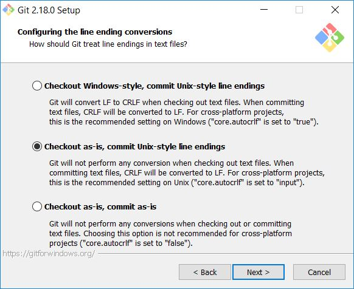
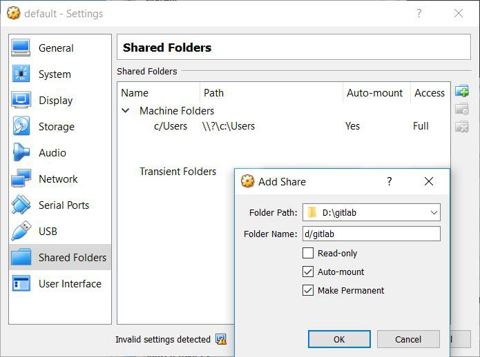

# Docker Toolbox on Windows 10

This document is intended for developers who are having trouble getting Docker to run on Windows. It lists the steps I had to take on Windows to be able to run an existing Docker project that was developed in a Linux environment. It took many hours of research and trial-and-error to compile this information so I hope it saves some time for others.

This documentation relates to **Docker Toolbox**.

## ***Introduction***

### *Docker Toolbox* vs *Docker for Windows*

The recommended version of Docker on a Windows platform is named "*[Docker for Windows](https://store.docker.com/editions/community/docker-ce-desktop-windows)*". It only runs on Windows 10 Pro: it uses *Hyper-V*.

For regular Windows 10, there's "*[Docker Toolbox](https://docs.docker.com/toolbox/overview/)*": it uses *Oracle VM VirtualBox*.

*Docker Toolbox* is an older version of Docker for Windows but in a cross-platform development team this seems to be a better choice since Oracle VM VirtualBox is used across different operating systems.

The generic "Docker for Windows" name for the recommended Docker version is unfortunate. Any online search for these terms may return *Docker Toolbox* results from a time when that was the only windows version of Docker available or it may return result for *Docker for Windows* proper. This makes troubleshooting *Docker Toolbox* issues extra complicated.


### Proper Docker setup

A proper Docker setup should be entirely isolated from its host: don't attempt to interface with Host volumes but instead use Docker volumes (also referred to as "named volumes") to persist data. Communicate with the outside world though APIs.

*However*, if you want your Docker container active during development, to be able to easily edit source files, a source directory is typically mounted as a Host volume.


### Access to host system

Issues may arise if a Docker container is configured to have read-write access to host volumes. If the Docker internals and the host are distinctly different systems (Windows OS vs Linux for instance) then this requires very careful setup of the Docker environment (as outline below). Still, this doesn't solve all potential issues: Node.js has code branching logic that distinguishes between Linux and Windows. Thus if code is running in a Linux container and tries to access Windows host system, it will branch out to the wrong logic (for Linux) and certain operations (like fsync) will fail since they require Windows-specific treatment. Thus, limit host access to read-only operations. Any data that is persisted (like NeDB database files) should be stored on a Named Docker Volume.


## ***Setup***

### Docker Toolbox setup on Windows 10

Following are the steps I had to take to get a Linux Docker container that required host file-system access to run on regular Windows 10 (not pro), using *Docker Toolbox*.

*The actions below may or may not work for your specific situation...*


#### Prevent bash script errors due to CR characters.

* While installing your *git bash* (or equivalent) command window (which comes with Git for Windows), configure it to checkout linefeeds as-is. i.e. LF (do not convert to CRLF)
* 


#### Allow Docker container scripts to access the Windows file system

* Open Oracle VM VirtualBox Manager
* Configure Docker VM named "default" to share the folder where your source code is located (if this is a location other than c:\Users).
  * Navigate to Shared Folders and click the Add Share button.
  * Choose an alias name that mimics a Linux style folder name. In my case, the code is in d:\gitlab, so I named the shared folder "d/gitlab".
  * Select "Auto-mount" and "Make Permanent"
  * 


#### Allow use of symlinks on the shared Folder

* Set a `SharedFoldersEnableSymlinksCreate` config variable to allow symlinks on the shared folder (if this is a location other than c:\Users):
```bash
VBoxManage.exe setextradata [VM_NAME] VBoxInternal2/SharedFoldersEnableSymlinksCreate/[SHARE_NAME] 1
```
In my case `VM_NAME="default"` and `SHARE_NAME="d/gitlab"`:
```bash
$ cd /c/"Program Files"/Oracle/VirtualBox
$ ./VBoxManage.exe setextradata default VBoxInternal2/SharedFoldersEnableSymlinksCreate/d/gitlab 1
```
Note: This enables the *use* of symlinks, *but does not give/set permissions!*

* PS: You can read the settings with
```bash
./VBoxManage.exe getextradata [VM_NAME] enumerate
```


#### Ensure all Docker scripts run in a Linux-like environment

Docker Toolbox comes with its own "quickstart" terminal. This should be used when interacting with Docker.

* Use ***Docker Quickstart Terminal*** (not git bash) to execute docker commands
  * This prevents POSIX conversions to Windows-style paths (which will happen in git bash terminal).
  * It allows docker commands to open a virtual terminal to inspect the inner details of the docker container.

Note: Weird that I didn't find any reference to this terminal on the [docker-for-windows](https://docs.docker.com/docker-for-windows) page. (They even recommend to use "Command Prompt or PowerShell, but not PowerShell ISE" which is misleading to say the least. Maybe this applies to "Docker for Windows" proper, but -as I found out the hard way- *not* for "Docker Toolbox").


#### Ensure that Docker scripts have permission to actually create symlinks

The action above only enabled the *use* of symlinks. To actually allow Docker scripts to *create* symlinks:

* Open Docker Quickstart Terminal *as Administrator*!
  * Right-click on the Docker Quickstart Terminal icon on the desktop (or start menu) and select *Run As Administrator*. 
  * If the Docker VM ("default") is running inside Oracle VM VirtualBox Manager, it needs to be Powered Off there first!! (or type `docker-machine stop` in a docker command window) and make sure that all regular Docker Quickstart Terminals are closed.
  * (Apparently, when run as Admin, the Quickstart Terminal starts the Docker VM, but that is not reflected within VirtialBox Manager - there it remains to be displayed as  "Powered Off".)
  * (This has the downside that you no longer can inspect the configuration settings for the Docker VM)


### Setup verification

If you get any "Read-only file system" or "Protocol error" errors, you've probable missed one or more of the previous steps.

If you see `*.cmd` files in your `node_modules/.bin` directory, you have missed the last step. After proper setup you should see only symlinked files there.

If you have a case like me where you need to get an existing Docker image up-and-running, you have so many variables of potential issues that it's better to isolate the problem areas. My main issue was the mounting of the host volume, and I discovered/verified most of the above solutions using a simple light-weight `alpine` Docker container.

```bash
# To verify access:
#    inspect the contents of a project folder on the host system:
# docker run -it -v [SHARE_NAME][PROJECT_FOLDER]:/data alpine ls /data/
$ docker run -it -v /d/gitlab/myproject/src:/data alpine ls /data/


# To verify file system operations:
#    run a shell script inside the container:
# docker run -it -v [SHARE_NAME][PROJECT_FOLDER]:/data alpine /bin/sh
$ docker run -it -v /d/gitlab/myproject/src:/data alpine /bin/sh
# We're now in the container environment, so we can try to create files, create symlinks etc:
$ ls -al test*
ls: test*: No such file or directory
$ touch testsymlink
$ ln -s ./testsymlink ./testsymlink2
$ ls -al test*
-rw-r--r--  1 root  root   0 Sep  6 21:15 testsymlink
lrwxrwxrwx  1 root  root  13 Sep  6 21:15 testsymlink2 -> ./testsymlink
# SUCCESS! Works as expected.
# You can also view the folder in Windows File Explorer to verify the files are visible/accessible there
```
